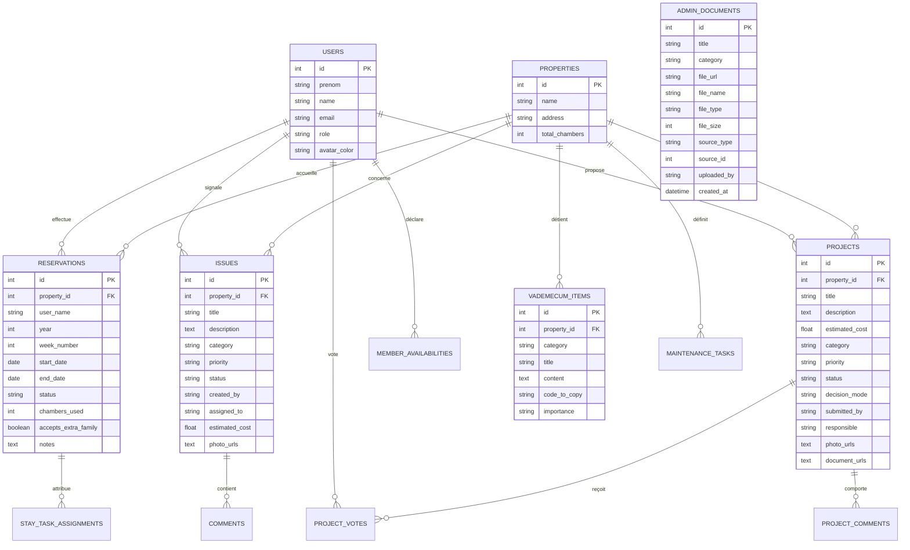

# Spécifications Graphiques et Techniques — SCI Familiale Hellenvilliers

> [!NOTE]
> **Projet** : Application Web de Gestion Patrimoniale, Financière et Juridique de la **SCI Hellenvilliers**.  
> **Gouvernance** : Henri Jamet (Coordinateur / Gérant opérationnel).  
> **Studio Google Stitch** : Project ID `4484682917577566744` | [Accéder au Studio Stitch](https://stitch.withgoogle.com/projects/4484682917577566744)  
> **Environnements** : Production Edge [https://hellenvilliers.henri-jamet.com](https://hellenvilliers.henri-jamet.com) | Intranet Serveur [https://sci.henri-jamet.com](https://sci.henri-jamet.com) | Local `http://localhost:3000` / `http://localhost:5173`

---

## 1. Identité de l'Application & Cadre Légal

* **Raison Sociale** : SCI HELLENVILLIERS (SIREN 977 529 312 RCS Évreux).
* **Capital Social** : 390 000,00 € divisé en 1 000 parts sociales de 390,00 €.
* **Siège Social** : 4 rue de l'Ancienne Mairie, Hellenvilliers, 27240 Mesnil-sur-Iton.
* **Patrimoine Détenu** :
  * **Propriété Rosing** (8 rue de l'Ancienne Mairie) : Parc, maison principale, dépendances, PAC géothermique/aérothermique 20 kW, piscine extérieure.
  * **Le Presbytère** (4 rue de l'Ancienne Mairie) : Maison de village louée/occupée.
  * *Exclusion formelle* : L'appartement parisien (75005 Gracieuse) ne fait pas partie de la SCI.
* **Associés (7 membres)** :
  * 2 Parents Usufruitiers (jouissance, usage et arbitrage).
  * 5 Enfants Nus-propriétaires (10% du capital chacun : Henri, Joséphine, Eugénie, Hortense, Alexandre).
  * Gérance opérationnelle : Henri Jamet.

---

## 2. Charte Graphique & Design System (Tailwind CSS)

L'application repose sur un style épuré, digne d'un portail bancaire et patrimonial haut de gamme, combiné à la convivialité d'une maison familiale.

### A. Palette Chromatique
* **Arrière-plans** :
  * Mode Clair (Par défaut) : `bg-slate-50` (`#f8fafc`) pour le canvas global, `bg-white` (`#ffffff`) pour les conteneurs et cartes.
  * Mode Sombre (Supporté) : `bg-slate-950` (`#020617`) pour le fond, `bg-slate-900` (`#0f172a`) pour les cartes et modals.
* **Couleurs Fonctionnelles & Sémantiques** :
  * `sci-emerald` (`#10b981`) : Validation, succès, cotisations à jour, statuts confirmés, solde bancaire positif.
  * `brand-500` / `brand-600` (`#0284c7`) : Bleu ciel de marque, liens interactifs, navigation principale, sélection active.
  * `sci-gold` (`#f59e0b`) : Ambre / Or, avertissements, demandes en attente d'approbation, dépenses d'énergie, budget prévisionnel.
  * `sci-ruby` (`#ef4444`) : Rouge d'urgence, alertes PAC/chauffage, pannes critiques, dépenses imprévues.
  * `sci-violet` (`#8b5cf6`) : Projets d'embellissement, initiatives familiales, votes démocratiques.
  * `sci-slate` (`#0f172a`) : Texte principal haute lisibilité, en-têtes contrastés.

### B. Typographie & Rythme Visuel
* **Polices** :
  * Titres et En-têtes : `'Outfit', 'Inter', system-ui, sans-serif` (police display ronde, contemporaine, élégante).
  * Corps de Texte et Tableaux : `'Inter', system-ui, -apple-system, BlinkMacSystemFont, sans-serif` (neutralité et lisibilité chirurgicale).
* **Échelle Typographique** :
  * Hero & Titre d'écran : `text-2xl` à `text-3xl font-black text-slate-900 tracking-tight`
  * Titres de Section : `text-lg font-bold text-slate-900`
  * Sous-titres & Labels : `text-xs font-bold uppercase tracking-wider text-slate-500`
  * Corps standard : `text-sm text-slate-700 leading-relaxed`
  * Métriques & Chiffres Clés : `text-xl font-extrabold text-slate-900`

### C. Tokens d'Élévation, Bordures et Verre (Glassmorphism)
* **Cartes Standard (`clean-card`)** : `bg-white border border-slate-200/80 rounded-2xl shadow-sm hover:shadow-md transition-all duration-200` (Dark: `bg-slate-900 border-slate-800`).
* **En-tête Flottant (`glass-header`)** : `bg-white/80 backdrop-blur-md border-b border-slate-200/80 sticky top-0 z-50` (Dark: `bg-slate-950/80 border-slate-800/80`).
* **Fenêtres Modales (`glass-modal`)** : `bg-white border border-slate-200 shadow-2xl rounded-3xl` (Dark: `bg-slate-900 border-slate-800`).
* **Rayons de Courbure** :
  * Badges, Boutons d'action, Champs de saisie : `rounded-xl` (12px)
  * Cartes de contenu, Widgets KPIs : `rounded-2xl` (16px)
  * Modals et Fenêtres de dialogue : `rounded-3xl` (24px)
  * Pastilles de statut & Avatars : `rounded-full` (9999px)

---

## 3. Architecture des Pages & Modules Métier

### Module 1 : Dashboard Trésorerie & KPIs
* **Indicateurs clés** : Solde estimé du compte bancaire SCI, total des cotisations CCA collectées, charges prévisionnelles de l'exercice (~14 000 €/an).
* **Vue Synthétique** : Alertes urgentes non résolues, séjours de la semaine, projets en cours de vote, statut du chauffage Rosing.
* **Accès Rapides** : Bouton « Signaler un problème », « Réserver un séjour », « Soumettre un projet de travaux ».

### Module 2 : Gestion des Charges Réelles & Énergie
* **Électricité Rosing (Compteur PAC 20 kW)** : Suivi des consommations et bascule sur l'offre **EDF Tempo** (300 jours bleus, économie annuelle estimée de 800 € à 1 200 €).
* **Fioul Domestique (Éts JOSSE)** : Jauge de cuve, historique des livraisons, commandes programmées en basse saison estivale (-300 € à -500 €).
* **Monitoring Thermique ViCare (Viessmann)** : Température ambiante en temps réel, consigne de chauffage, modes confort/éco/hors-gel pilotables à distance.

### Module 3 : Comptes Courants d'Associés (Compte 455)
* **Règle Fondamentale** : Cotisation obligatoire de **50,00 € / mois par branche** sur le compte bancaire de la SCI (Crédit Agricole Normandie-Seine ou Qonto).
* **Copie Rapide du RIB** : Module de copie en 1 clic de l'IBAN/BIC avec libellé normalisé obligatoire `Apport CCA - [Prénom]`.
* **Tableau de Réconciliation** : Suivi des versements mensuels pour chacun des 7 associés et historique des apports.

### Module 4 : Gestion Spécifique de la Piscine Rosing (Accord Frédéric Jamet)
* **Phase 1 (Jusqu'au 31/12/2026)** : Prise en charge intégrale des factures **DECLERCQ PISCINES** directement par **Frédéric Jamet** (incluant la facture FA0069094 acquittée). Neutralisation totale des charges pour la trésorerie courante de la SCI.
* **Phase 2 (À compter du 01/01/2027)** : Virement permanent dédié de **1 000,00 € / mois** versé par Frédéric Jamet pour le fonctionnement, l'électricité, les produits de traitement et l'entretien du bassin.
* **Affichage Dédié** : Suivi des interventions de maintenance estivale, hivernage et analyses d'eau.

### Module 5 : Dossier Juridique, KYC & Procès-Verbaux d'AG
* **Conformité Bancaire LCB-FT** :
  * Statuts constitutifs signés et certifiés (Me Goumard-Geffré, 7 août 2023).
  * Extrait Kbis actualisé (SIREN 977 529 312 RCS Évreux).
  * Récépissé du Registre des Bénéficiaires Effectifs (RBE).
  * Pièces d'identité des 7 associés (passeports/CNI des parents et des 5 enfants).
* **Gouvernance & AG** :
  * Procès-verbal de l'AG n°1 du 8 août 2026 (mandat de coordination confié à Henri Jamet).
  * Documents d'approbation des comptes annuels et convocations.

### Module 6 : Calendrier Croisé & Réservation des Séjours
* **Planning Annuel** : Grille des 52 semaines ISO pour 2026 et 2027.
* **Capacité d'Accueil** : Gestion des 7 chambres de la propriété Rosing.
* **Modèle d'Équilibrage de Charge (Formule Henri)** :
  * Score d'occupation : $O_u = \sum (\text{jours} \times \text{chambres})$.
  * Pénalité d'exclusivité : Réservation avec blocage de la maison = comptabilisation à 100% de la capacité (7 chambres).
  * Charge cible proportionnelle : Répartition équitable des tâches d'intendance au prorata de la présence effective.

### Module 7 : Projets de Travaux & Démocratie Participative
* **Types** : Signalements simples vs Initiatives de rénovation/embellissement.
* **Workflow** : Soumission -> Examen par Henri -> Validation directe (< 300 €) ou mise au vote familial.
* **Scrutin Familial** : Votes POUR, CONTRE, ABSTENTION ou REPORT À L'AG (règle du veto individuel pour les décisions majeures).

### Module 8 : Vadémécum & Intendance Familiale
* **Fiches Pratiques** : Codes Wi-Fi, armoire électrique, robinet d'arrêt général d'eau, manipulation de la PAC, consignes poubelles et tri.
* **Checklists de Séjour** : Tâches d'arrivée (ouverture compteurs, chauffage) et tâches de départ (draps, ménage, abaissement température, extinction lumières, fermeture volets).

---

## 4. Schéma Relationnel des Données (Supabase / PostgreSQL)

---

## 5. Règle d'Or Opérationnelle pour l'IA

> [!CAUTION]
> **ZÉRO GÉNÉRATION DE VISUELS PAR L'AGENT**  
> L'agent IA n'appelle **JAMAIS** `generate_screen_from_text`, `edit_screens` ou `generate_variants`.  
> La conception visuelle, la retouche des maquettes et l'arbitrage esthétique sont l'exclusivité d'**Henri** directement dans le studio web Google Stitch.
