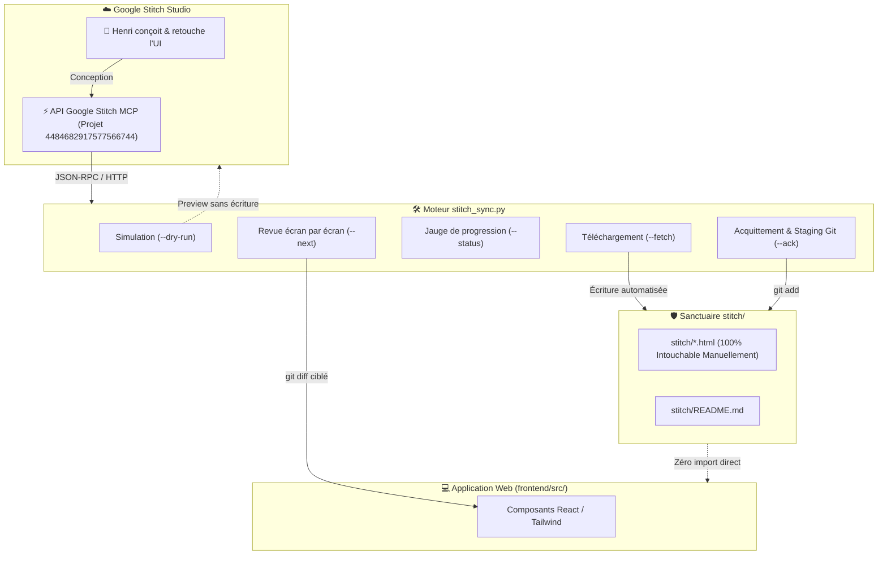

# 🎨 Continuous Stitch Sync Diff Engine (`stitch_sync.py`)

Ce document décrit le fonctionnement, l'architecture et les commandes du moteur de synchronisation continue et de diff textuel entre le studio UI **Google Stitch** et le dépôt local **`sci-family-app`**.

---

## 🏛️ Architecture & Principes Fondamentaux



### 1. Règle Cardinale du Sanctuaire `stitch/`
- **Intouchable Manuellement** : Le dossier `stitch/` à la racine du dépôt git est un sanctuaire de maquettes brutes. Aucun agent ni développeur ne doit y éditer manuellement un fichier.
- **Découplage Runtime Total** : L'application React frontend n'importe jamais directement un fichier HTML issu de `stitch/`. Le dossier `stitch/` n'est pas empaqueté dans le bundle de production Vercel (`outputDirectory: frontend/dist`).
- **Base de Vérité Git Diff** : Le dossier `stitch/` est exclusivement alimenté par `stitch_sync.py` et sert de base de référence versionnée par Git pour visualiser les deltas textuels exacts (`git diff`) à chaque retouche dans Stitch.

---

## 🚀 Commandes CLI Opérationnelles

### 1. Simulation Sans Écriture (`--dry-run`)
Vérifie la connexion à Google Stitch MCP, inspecte les maquettes distantes et affiche un bilan complet des écrans identiques, modifiés et nouveaux **sans écrire sur le disque ni modifier Git** :
```bash
python stitch_sync.py --dry-run
```
*Exemple de sortie :*
```
📊 RAPPORT DE SIMULATION (DRY-RUN) — Projet 4484682917577566744
  • 11 écran(s) déjà parfaitement synchronisé(s) et identiques
  • 0 écran(s) présentant des modifications distantes
  • 0 nouvel/nouveaux écran(s) à importer
```

### 2. Téléchargement & Synchronisation Initiale (`--fetch`)
Télécharge les maquettes depuis Google Stitch MCP dans `stitch/`, sans `git add` global, et affiche la liste des écrans nécessitant une intégration :
```bash
python stitch_sync.py --fetch
```
*Note :* Si le projet est déjà à jour, le script affiche un message de confirmation et s'arrête sans altérer l'arbre de travail :
```
✅ Aucun changement détecté dans Stitch. Le dossier stitch/ est déjà parfaitement synchronisé (11 écrans vérifiés).
```

### 3. Consultation de la Progression (`--status`)
Affiche le décompte exact des écrans déjà intégrés et acquittés (`[x]`) face aux écrans restant à traiter (`[ ]`) :
```bash
python stitch_sync.py --status
```
*Exemple de jauge :*
```
📊 Progression de la synchronisation Stitch : [1/7]
  • 1 écran(s) intégré(s) et acquitté(s) (stagé(s))
  • 6 écran(s) en attente d'intégration (unstaged)
```

### 4. Revue Pas-à-Pas des Diff (`--next`)
Affiche le diff textuel ciblé (`git diff`) du prochain écran non encore acquitté, avec les directives d'implémentation pour adapter `frontend/src/` :
```bash
python stitch_sync.py --next
```

### 5. Acquittement & Staging Git (`--ack <fichier>`)
Ajoute l'écran traité à l'index Git (`git add`), confirme la prise en compte, et enchaîne immédiatement sur le diff de l'écran suivant :
```bash
python stitch_sync.py --ack stitch/tableau_de_bord_general_navigation_piliers_thematiques.html
```
*Dès que 100% des écrans sont acquittés, `stitch_sync.py` génère automatiquement le commit de clôture atomique :*
```
chore(stitch): sync and integrate all screens 2026-09-25 18:13:12
```

---

## ⚙️ Options & Configuration Avancée

| Argument CLI | Variable d'Environnement | Valeur par Défaut | Rôle |
|---|---|---|---|
| `--project <id>` | `STITCH_PROJECT_ID` | `4484682917577566744` | Identifiant du projet Google Stitch. |
| `--dry-run` | - | `False` | Simulation de synchronisation en lecture seule. |
| `--fetch` | - | `False` | Téléchargement actif des maquettes distantes. |
| `--status` | - | `False` | Affichage de la jauge de suivi du staging Git. |
| `--next` | - | `False` | Affichage du diff de l'écran suivant. |
| `--ack <fichier>` | - | `None` | Validation unitaire et staging Git d'un écran. |
| `--mcp-config <path>`| `MCP_CONFIG_PATH` | `C:\Users\Jamet\.config\mcp\mcp_servers.json` | Emplacement du fichier de configuration des serveurs MCP. |
| `--source <path>` | - | `None` | Fichier HTML ou archive ZIP source manuelle (fallback). |

---

## 🛡️ Résilience Réseau & Gestion des Erreurs

1. **Authentification Directe Robuste** : Utilisation exclusive du header `X-Goog-Api-Key` extrait de la configuration MCP, garantissant un téléchargement HTTP direct sans dépendance de session navigateur expirée.
2. **Gestion du Rate Limiting (HTTP 429)** : Boucle de retry automatique avec backoff exponentiel (2s, 4s, 6s) sur les requêtes vers l'API et le CDN Google Stitch.
3. **Protection contre l'Écrasement Aveugle** : Si un export local est utilisé en fallback, il n'est appliqué que si le nom de fichier ou le titre correspond spécifiquement à l'écran analysé.
4. **Sanctuarisation Automatique du README** : Le fichier `stitch/README.md` est systématiquement stagé en tâche de fond pour ne jamais polluer les diffs applicatifs.
